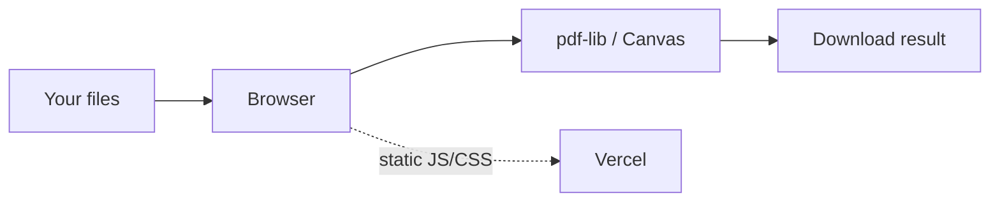

<p align="center">
  
</p>

<p align="center">
  <strong>PDF merge &amp; image resize in the browser.</strong><br/>
  Hosted on Vercel as a static frontend — your files are not uploaded or stored.
</p>

<p align="center">
  <a href="https://clipper.vercel.app"></a>
  &nbsp;
  <a href="https://github.com/MikolajTanski/Clipper"></a>
</p>

<p align="center">
  
  
  
  
  
</p>

---

## Why this project (for recruiters)

| | |
| --- | --- |
| **Problem** | Quick PDF stitch / image resize without uploading documents to a processing API. |
| **Approach** | SPA on **Vercel**: merge with **pdf-lib**, previews with **pdf.js**, resize with **Canvas** — no backend. |
| **Proof** | Static hosting only. Tab *O aplikacji* explains: processing in the browser, nothing saved on the server. |
| **Ship** | Vite build, unit tests, Docker (Nginx), `vercel.json` for SPA deploy. |



Nothing crosses the network except loading the app itself.

---

## Features

| Tool | What you get |
| --- | --- |
| **Scal PDF** | Drop → reorder → optional blank pages → download `spinacz.pdf` |
| **Rozmiar zdjęć** | JPEG / PNG / WebP (GIF → PNG), aspect lock, live size estimate |
| **O aplikacji** | Privacy note (PL) + links to demo & this repo |

---

## Quick start

```bash
cd frontend
npm ci
npm run dev      # http://localhost:5173
```

```bash
npm test
npm run build
```

**Docker**

```bash
docker compose up --build -d   # http://localhost:8080
```

**Vercel** — connect this repo; root `vercel.json` builds `frontend/` and publishes `frontend/dist`.

---

## Stack at a glance

```
React + TypeScript + Vite
        │
        ├─ pdf-lib     → merge PDFs in-memory
        ├─ pdf.js      → page thumbnails
        └─ Canvas API  → image resize / export
```

Optional: Docker → Nginx static host · Vercel → production demo.

---

## Repo layout

```
Clipper/
├── assets/spinacz-banner.svg
├── vercel.json
├── docker-compose.yml
└── frontend/          ← the whole product
    ├── Dockerfile
    ├── src/
    └── ...
```

---

## Privacy

> **No server-side processing.** Files are not uploaded or stored. Vercel serves HTML/JS/CSS only.

---

## Po polsku

**Spinacz** jest dostępny online na [Vercel](https://clipper.vercel.app) jako **statyczny frontend**. Nie ma backendu ani bazy — Twoje pliki **nie są uploadowane ani zapisywane** na serwerze; cała robota dzieje się w przeglądarce.

| Link | |
| --- | --- |
| Aplikacja | [clipper.vercel.app](https://clipper.vercel.app) |
| Kod | [github.com/MikolajTanski/Clipper](https://github.com/MikolajTanski/Clipper) |

W UI zakładka **O aplikacji** opisuje to samo: hosting na Vercel, przetwarzanie w przeglądarce, brak zapisu plików, link do repozytorium.
