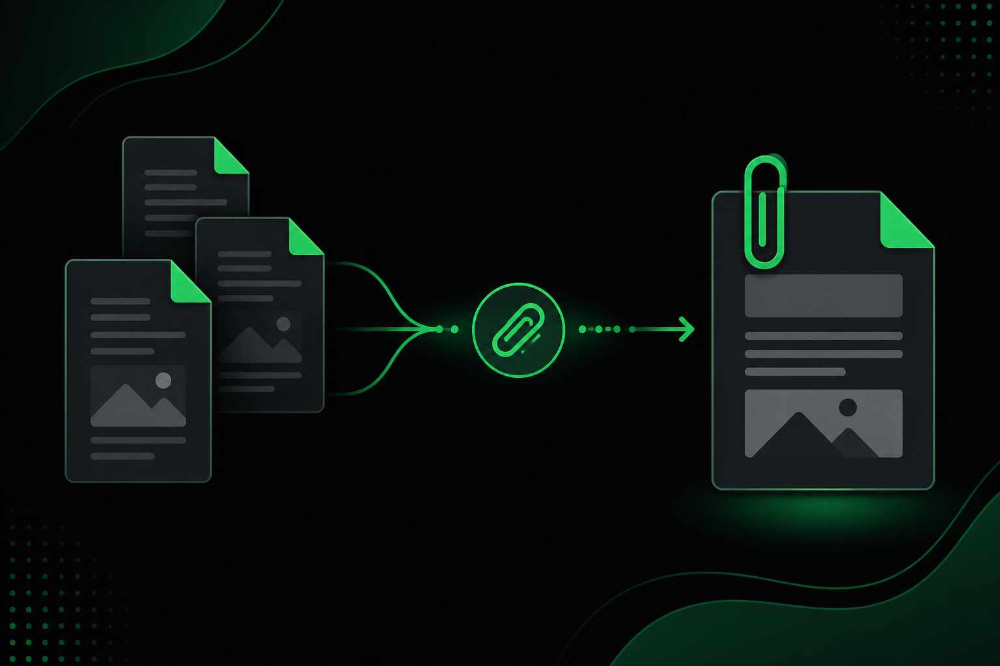
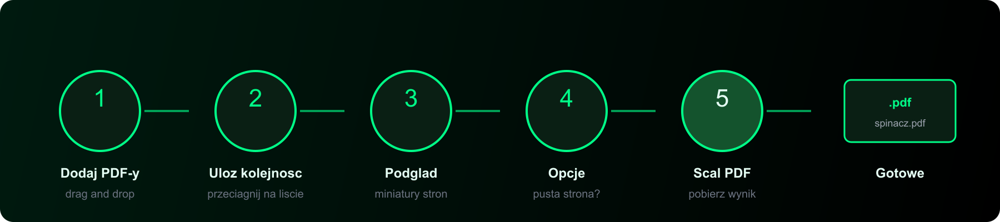

# Spinacz



**Spinacz** to proste narzędzie do łączenia plików PDF — lokalnie, bez chmury, bez kont, bez AI.  
Powstało, bo na studiach wkurzało mnie ręczne sklejanie PDF-ów przed oddaniem prac. Macie to, korzystajcie jak chcecie.

---

## Szybki start

```bash
docker compose up --build -d
```

Otwórz **[http://localhost:8080](http://localhost:8080)** → dodaj pliki → ułóż kolejność → **Scal PDF** → pobierz `spinacz.pdf`.

> Pierwszy raz? Pełny przewodnik krok po kroku: **[docs/setup.md](docs/setup.md)**

---

## Co potrafi

| Funkcja | Web UI | CLI | API |
|---------|:------:|:---:|:---:|
| Scalanie wielu PDF-ów | ✅ | ✅ | ✅ |
| Zmiana kolejności plików | ✅ | ✅ | ✅ |
| Podgląd miniaturek | ✅ | — | — |
| Pusta strona między plikami | ✅ | ✅ | ✅ |
| Wybór zakresów stron (`1-3,5,7-`) | — | ✅ | ✅ |

---

## Jak to wygląda



1. **Dodaj** pliki PDF (drag & drop lub kliknięcie)
2. **Ułóż** kolejność na liście po prawej
3. **Zobacz** podgląd „zszytego” dokumentu po lewej
4. **Opcjonalnie** włącz pustą stronę między plikami
5. **Scal** i pobierz wynik

---

## Architektura w skrócie


Dwa kontenery Docker: **React + Nginx** (front) i **Flask + pypdf** (backend).  
Wspólna logika scalania w `backend/core.py` — używana przez Web UI, API i CLI.

---

## Dokumentacja

Pełna dokumentacja jest podzielona na sekcje — traktuj [`docs/README.md`](docs/README.md) jak spis treści / hub:

| Sekcja | Opis |
|--------|------|
| [🚀 Jak postawić (setup)](docs/setup.md) | **Start tutaj** — rozpisany proces instalacji krok po kroku |
| [📚 Hub dokumentacji](docs/README.md) | Spis wszystkich zakładek |
| [🏗 Architektura](docs/architecture.md) | Warstwy, przepływ danych, Docker, diagramy |
| [📖 Użycie i przykłady](docs/usage.md) | Web UI, CLI, API z przykładami `curl` |
| [🛠 Rozwój lokalny](docs/development.md) | Uruchomienie bez Dockera, struktura projektu |

---

## Stack

- **Backend:** Python 3, Flask, pypdf, Typer (CLI)
- **Frontend:** React 18, Vite, TypeScript, pdf.js (podgląd)
- **Produkcja:** Nginx (statyczny front + proxy `/api`), Docker Compose

---

## Licencja

Używajcie jak chcecie — bez ograniczeń, bez gwarancji, bez zbierania danych.  
Pliki nigdy nie opuszczają Waszej maszyny (o ile sami nie wystawicie backendu na świat).

---

## Historia

Spinacz nie powstał jako produkt „idealny pod każdym względem” — to narzędzie robione pod konkretną irytację: sklejanie PDF-ów przed oddaniem prac na studiach.

Kilku znajomych z grupy też z niego korzystało i sobie chwaliło — mimo że daleko mu do ideału. I o to chodziło: **rozwiązywał problem biznesowy**, a nie udawał wielką platformę. Jeśli Wam też pomoże, tym lepiej.
