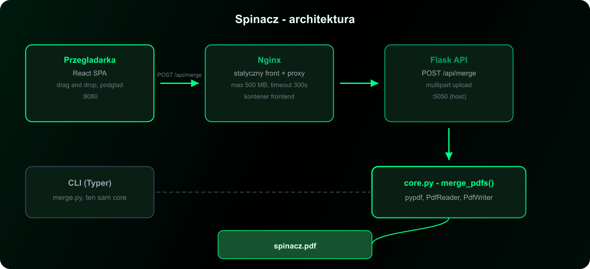
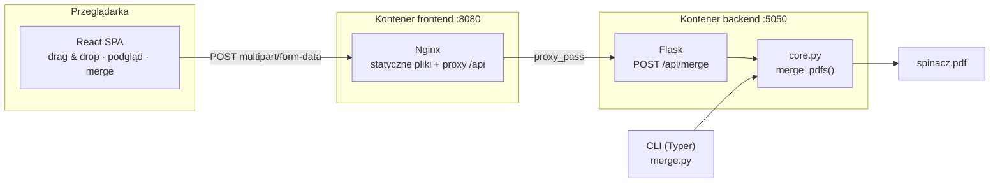
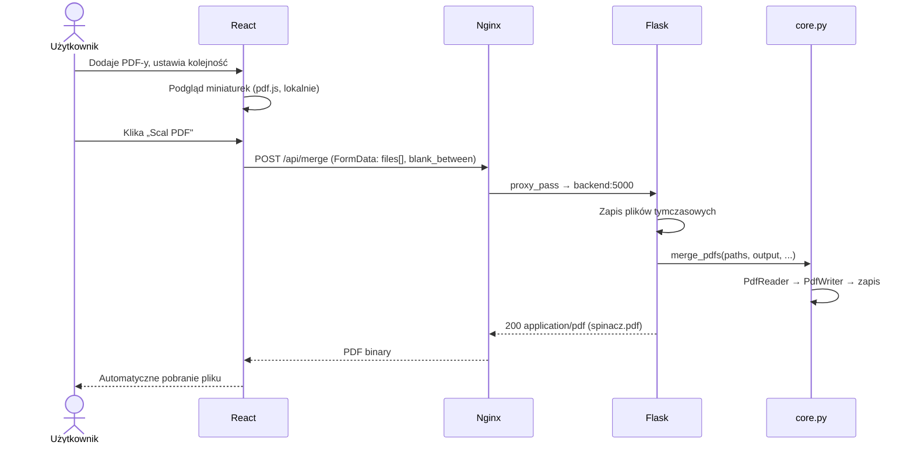

# Architektura Spinacza

Spinacz to monolit podzielony na dwa kontenery Docker: frontend (React + Nginx) i backend (Flask + pypdf). Nie ma bazy danych, kolejki ani zewnętrznych usług.

---

## Diagram wysokiego poziomu

---

## Warstwy

### 1. Frontend (`frontend/`)

| Element | Technologia | Rola |
|---------|-------------|------|
| UI | React 18 + TypeScript | Interakcja użytkownika |
| Build | Vite 5 | Bundling, dev server |
| Podgląd | pdf.js | Miniatury pierwszych stron (w przeglądarce) |
| Produkcja | Nginx 1.27 | Serwowanie SPA + reverse proxy do API |

**Komponenty:**

| Plik | Odpowiedzialność |
|------|------------------|
| `App.tsx` | Stan aplikacji, upload XHR, pobieranie wyniku |
| `FileDropzone.tsx` | Drag & drop i wybór plików |
| `FileList.tsx` | Lista plików z reorder (drag) |
| `DocumentPreview.tsx` | Renderowanie miniaturek przez pdf.js |

Frontend **nie** scala PDF-ów — tylko wysyła pliki do API i pobiera wynik.

### 2. Backend (`backend/`)

| Plik | Rola |
|------|------|
| `core.py` | **Jedyna** logika scalania — `merge_pdfs()` |
| `web.py` | Flask API — `POST /api/merge` |
| `cli.py` | Interfejs Typer — komenda `merge` |
| `merge.py` | Punkt wejścia CLI |

**Silnik PDF:** [pypdf](https://pypdf.readthedocs.io/) — `PdfReader` + `PdfWriter`.

### 3. Infrastruktura

| Plik | Rola |
|------|------|
| `docker-compose.yml` | Orkiestracja dwóch serwisów |
| `frontend/Dockerfile` | Multi-stage: Node (build) → Nginx (runtime) |
| `backend/Dockerfile` | Python 3.13-slim, `CMD python web.py` |
| `frontend/nginx.conf` | SPA routing, proxy `/api/`, limity uploadu |

---

## Przepływ scalania (Web UI)

---

## Logika scalania (`core.py`)

Funkcja `merge_pdfs()` przyjmuje:

| Parametr | Typ | Opis |
|----------|-----|------|
| `input_files` | `Iterable[Path]` | Pliki wejściowe w kolejności scalania |
| `output_file` | `Path` | Ścieżka pliku wynikowego |
| `page_ranges` | `Sequence[Sequence[int]] \| None` | Opcjonalne indeksy stron (0-based) per plik |
| `blank_between` | `bool` | Pusta strona między plikami |

**Algorytm:**

1. Dla każdego pliku wejściowego — walidacja (istnieje, rozszerzenie `.pdf`)
2. Otwarcie `PdfReader`, wybór stron (wszystkie lub z `page_ranges`)
3. Dodanie stron do `PdfWriter`
4. Jeśli `blank_between` — wstawienie pustej strony o wymiarach ostatniej strony
5. Zapis wyniku do `output_file`

Pusta strona dopasowuje `mediabox` ostatniej scalonej strony, żeby format był spójny.

---

## Konfiguracja (hardcoded)

Projekt **nie używa** plików `.env` ani zmiennych środowiskowych.

| Ustawienie | Wartość | Plik |
|------------|---------|------|
| Port frontu (host) | `8080` | `docker-compose.yml` |
| Port backendu (host) | `5050` | `docker-compose.yml` |
| Port Flask (kontener) | `5000` | `backend/web.py` |
| Max upload | `500 MB` | `frontend/nginx.conf` |
| Timeout proxy | `300 s` | `frontend/nginx.conf` |
| Nazwa pliku wynikowego | `spinacz.pdf` | `backend/web.py`, `App.tsx` |

---

## Bezpieczeństwo i prywatność

- Pliki trafiają tylko na lokalny backend — **nic nie jest wysyłane na zewnątrz**
- Brak autentykacji — narzędzie zakłada użycie lokalne / zaufane środowisko
- Pliki tymczasowe tworzone przez API (`NamedTemporaryFile`) — w produkcji warto dodać cleanup po wysłaniu odpowiedzi
- Nie wystawiaj backendu publicznie bez dodatkowych zabezpieczeń (rate limiting, auth)

---

## Co Spinacz **nie** robi

- Nie dzieli PDF-ów na części
- Nie edytuje treści stron (tekst, obrazy)
- Nie kompresuje ani nie optymalizuje rozmiaru
- Nie obsługuje haseł / szyfrowanych PDF-ów (ograniczenie pypdf bez dodatkowej konfiguracji)
- Nie zapisuje historii — każde scalanie to świeże żądanie

---

## Powrót do spisu treści

← [Dokumentacja](README.md) · [Użycie i przykłady →](usage.md)
